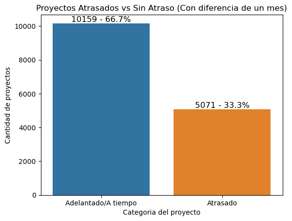
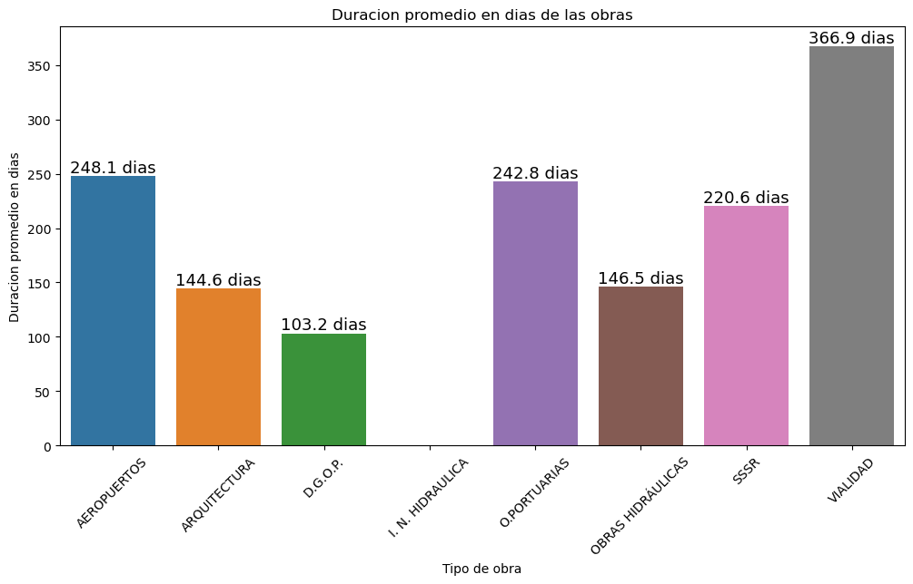

# Estudio de Proyectos de Construcción publica en Chile (2018-2023): Un Análisis Integral
## Introduccion

En toda nacion el manejo las obras publicas son una parte escencial del pais, ya que estan financiadas por la
misma gente y se utilizan por ejemplo: reparar, mejorar o mejorar infrastructura en el pais; asi mismo
con los sistemas de transporte como carreteras, puertos, entre otros.

Esto no es una excepcion en Chile, sin embargo, existe una problematica frecuente con respecto al tiempo 
y presupuesto estimado por cada obra, ya que generalmente surgen problemas al llevar a cabo estos proyectos
tan longebos y esto deriva en 

En nuestro proyecto a traves de los datos publicos del gobierno trataremos de responder a las siguentes
preguntas ¿Cual es el procentaje de atraso de las obras publicas? ¿Que tipo de obras tarda mas en realizarse?
¿Que tipo de obra es mas cara? ¿Como varia el presupuesto de las obras públicas según el año?

Nuestros principales objetivos son realizar una critica constructiva al sistema de obras publicas, midiendo la eficiencia
de los contratos realizados con empresas a traves de la diferencia del tiempo estimado y la duracion total
de la realizacion de la obra. Ademas de publicar nuestros resultados para el publico general y mostrar de una manera
accesible a personas de a pie sobre esta problematica.

A continuacion se revisaran y detallaran las metricas que hemos detectado, nuestra metodologia y la fuente
de nuestros recursos extraidos de el conjunto de datos del gobierno de chile. Para procesar datos para
el proyecto se utiliza ELT y se detallara nuestra metodologia, Ademas de contar con un analisis exploratorio
de datos (EDA) que sera donde se concretaran nuestra respuesta a las incogintas planteadas.

## Desarrollo

### ELT

Para el desarrollo de la extraccion de datos como es mencionado anterior mente se han extraido de los
dataset publicos del gobierno, pero, decidimos cargar estos datos sin transformarlos previamente a nuestro
repositorio para luego ser transformados, ya que en nuestro desarrollo se venia benificiado la carga de todos
los datos del proyecto a traves de GitHub y consideramos que esta posibilidad hace que sea mucho mas transparente
y replicable la transformacion y exploracion de estos datos. En este proceso se utilizo principalmente la libreria
de Pandas y su manejo de datos para emplear la transformacion apoyandonos con jupyter notebooks para el manejo de codigo.

Nuestra metodologia utilizando Pandas fue el siguente para cada conjunto de datos. En primer lugar se
cargaban los datos a procesar, a continuacion se aplicaba la transformacion de datos correspondientes para
su uso proximo y se removian datos que fueran completamente iguales. Ademas para el conjunto de datos de las sociedades
se aplico este misma metodologia pero antes se concatenaron todos las sociedades de los distintos años.

### EDA
El porcentaje de obras publicas atrasadas desde el primero de enero de 2010 hasta el 26 de junio de 2024
que se han retrasado por lo menos un mes es de el 33.3% respecto al total y en total fueron 5071 contratos,
en cambio los contratos que se demoraron menos de un mes en finalizarse son un 66.7% con una cantidad
10159 contratos. Vease la Imagen 1.

Imagen 1. Fuente: Autores.

Por otra parte tomando como base las obras con contratos terminados tienen una duracion en promedio:

Ordenadas de manera desendiente

1. Vialidad, duran aproximadamente un año

2. Aeropuertos, duran aproximadamente 249 dias

3. Obras Portuarias, duran aproximadamente un año

4. SSSR, duran aproximadamente un año

5. Obras hidraulicas, duran aproximadamente un año

6. Arquitectura, duran aproximadamente un año

7. D. G. O. P., duran aproximadamente un año

8. I. N. Hidraulica, No hay informacion

Para determinar estos valores se filtraron todos los valores  

Imagen 2, Fuente: Autores.

A su ves, hemos

## Conclusion

## Fuente Datasets
[Fuente prinpcipal conjunto de datos publicos del gobierno de chile](https://datos.gob.cl)

1. [Dataset Contratos de obra publica](https://datos.gob.cl/dataset/contratos-de-obra-publica-st-31)

2. [Dataset proyectos de obra publica](https://datos.gob.cl/dataset/proyectos-de-obra-publica-st-31)

3. [Dataset ofertas de obra publica](https://datos.gob.cl/dataset/ofertas-en-licitaciones-de-obra-publica-st-31)

4. [Dataset pagos de obra publica](https://datos.gob.cl/dataset/pagos-asociados-a-contratos-de-obra-publica-st-31)

5. [Dataset pagos de obra publica](https://datos.gob.cl/dataset/requisitos-de-contratistas-por-contratos-de-obra-publica-st-31)

6. [Dataset sociedades y empresas](https://datos.gob.cl/dataset/registro-de-empresas-y-sociedades)