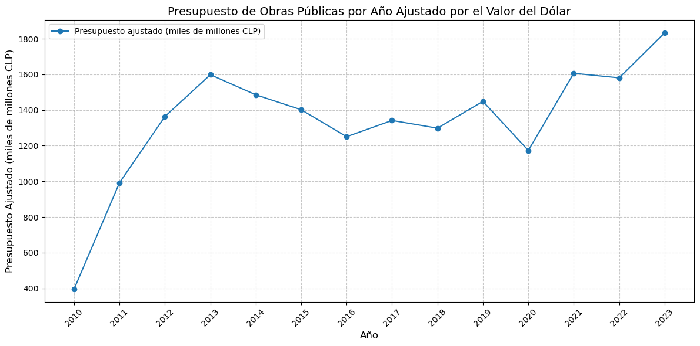
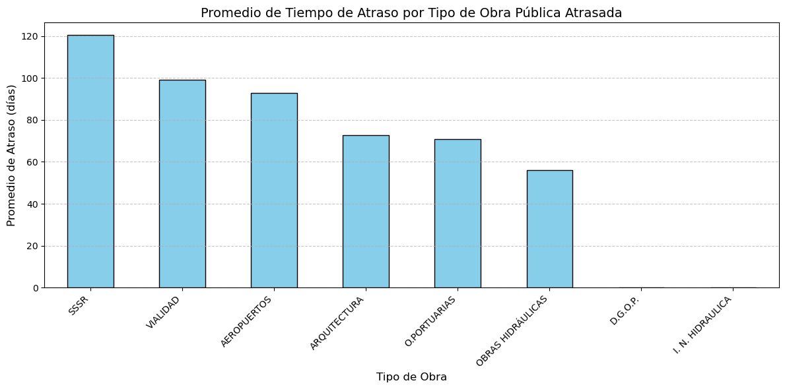

# Estudio de Proyectos de Construcción publica en Chile (2018-2023): Un Análisis Integral

## Introduccion

En toda nación, el manejo de las obras públicas son una parte esencial del país, ya que están financiadas por la misma gente y se utilizan, por ejemplo, para reparar, mejorar o renovar infraestructura en el país, así como los sistemas de transporte, como carreteras, puertos, entre otros.

Esto no es una excepción en Chile; sin embargo, existe una problemática frecuente con respecto al tiempo y presupuesto estimado por cada obra, ya que generalmente surgen problemas al llevar a cabo estos proyectos tan largos, lo que deriva en situaciones como la posibilidad de extensión de plazos, necesidad de aumentar el presupuesto, etc.

En nuestro proyecto, a través de los datos públicos del gobierno trataremos de responder a las siguientes preguntas: ¿Cuál es el porcentaje de atraso de las obras públicas? ¿Qué tipo de obras tarda más en realizarse? ¿Qué tipo de obra es más cara? ¿Cómo varía el presupuesto de las obras públicas según el año?

Nuestros principales objetivos son realizar una crítica constructiva al sistema de obras públicas, midiendo la eficiencia de los contratos realizados con empresas a través de la diferencia entre el tiempo estimado y la duración total de la realización de la obra. Además, publicaremos nuestros resultados de manera accesible, para el público general.

A continuación se revisaran y detallarán las métricas que hemos detectado, nuestra metodología y la fuente de nuestros recursos extraídos del conjunto de datos del gobierno de Chile. Para procesar los datos del proyecto, se utilizará ELT y se detallará nuestra metodología, además de contar con un análisis exploratorio de datos (EDA) que será donde se concretarán nuestra respuesta a las incógnitas planteadas.

## Desarrollo

### ELT

Para el desarrollo de la extracción de datos como se mencionó anteriormente, estos fueron extraídos de los dataset públicos del gobierno. Sin embargo, decidimos cargar los datos sin transformarlos previamente a nuestro repositorio para luego ser transformados, ya que en nuestro desarrollo nos beneficiamos de la carga de todos los datos del proyecto a través de GitHub. Consideramos que esta posibilidad hace que la transformación y exploración de estos datos sea mucho más transparente y replicable. En este proceso se utilizó principalmente la librería de Pandas y su manejo de datos para realizar las transformaciones apoyándonos en Jupyter Notebooks para el manejo del código.

Nuestra metodología utilizando Pandas fue el siguiente para cada conjunto de datos. En primer lugar, se cargaban los datos a procesar; a continuación, se aplicaba la transformación de datos correspondientes para su uso próximo y se removían datos que fueran completamente iguales. Además, para el conjunto de datos de las sociedades se aplicó esta misma metodología, pero antes se concatenaron todas las sociedades de los distintos años.

### EDA

El porcentaje de obras públicas atrasadas desde el 1 de enero de 2010 hasta el 26 de junio de 2024, que se han retrasado al menos un mes, es del 33.3% respecto al total, con un total de 5,071 contratos. En cambio, los contratos que se demoraron menos de un mes en finalizarse representan el 66.7% con un total de 10,159 contratos. Véase la Imagen 1.

Imagen 1. Fuente: Autores.

Por otra parte tomando como base las obras con contratos terminados, en el siguente grafico (vease la Imagen 2) se muestra
la duracion promedio en dias de cada tipo servicio que realizaban las obras.

Imagen 2, Fuente: Autores.

Ademas, exploramos el presupuesto total invertido en las obras publicas como se puede ver en la siguente imagen, hubo una tendencia
al alza, pero se ve claramente un descenso en el año 2020. 

 
Imagen 3, Fuente Autores.

Imagen 4, Fuente: Autores.

Extensiones Futuras: Este análisis podría ampliarse incluyendo más años o integrando datos relacionados con la calidad de las obras finalizadas, para medir el impacto del retraso en la satisfacción pública.

Problemas Éticos: La transparencia en la gestión de fondos públicos es crítica. Este proyecto destaca la importancia de usar datos abiertos para evaluar la eficiencia del gasto público.

Posibles Fuentes de Error: 

•	 Calidad de los datos: Los datos disponibles pueden contener errores o información incompleta. 

•	Limitaciones en la metodología: No se consideraron factores externos, como desastres naturales o cambios políticos, que      podrían haber influido en los retrasos.

## Conclusion

El análisis de las obras públicas en Chile revela que los retrasos son un problema significativo, con un 33% de los proyectos superando el mes de atraso. A pesar de un aumento general en el presupuesto, las fluctuaciones en los costos y tiempos reflejan la necesidad de mejorar la planificación y ejecución. Utilizar datos abiertos es fundamental para aumentar la transparencia y la rendición de cuentas, y este estudio destaca la importancia de implementar mejoras en la gestión para optimizar recursos y resultados en futuros proyectos.

## Recomendaciones

1. Mejorar la Planificación

    Implementar sistemas de planificación más robustos y flexibles para minimizar los riesgos de atrasos y sobrecostos.

2. Promover la Competitividad

    Fomentar la participación de más empresas en el mercado de contratos públicos para aumentar la competencia y la eficiencia

3. Fortalecer la Gestión

    Capacitar a los equipos de gestión de proyectos para mejorar sus habilidades y conocimientos en la planificación, ejecución y control de obras públicas.
    
4. Transparencia y Acceso a la Información

    Garantizar la transparencia en la adjudicación de contratos y el acceso público a la información sobre los proyectos de obras públicas.
    

## Fuente Datasets
[Fuente prinpcipal conjunto de datos publicos del gobierno de chile](https://datos.gob.cl)

1. [Dataset Contratos de obra publica](https://datos.gob.cl/dataset/contratos-de-obra-publica-st-31)

2. [Dataset proyectos de obra publica](https://datos.gob.cl/dataset/proyectos-de-obra-publica-st-31)

3. [Dataset ofertas de obra publica](https://datos.gob.cl/dataset/ofertas-en-licitaciones-de-obra-publica-st-31)

4. [Dataset pagos de obra publica](https://datos.gob.cl/dataset/pagos-asociados-a-contratos-de-obra-publica-st-31)

5. [Dataset pagos de obra publica](https://datos.gob.cl/dataset/requisitos-de-contratistas-por-contratos-de-obra-publica-st-31)

6. [Dataset sociedades y empresas](https://datos.gob.cl/dataset/registro-de-empresas-y-sociedades)